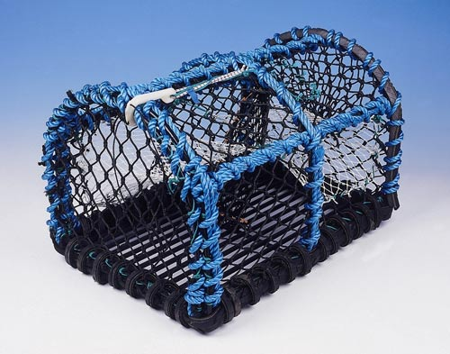

# Nasse

Home-made NAS with Arch, Btrfs raid 5 and shucked drives. The ~~bottom of the ocean~~ sky is the limit.

## Parts

Summary: 4 cores, 8GB DDR4, 24TB storage, 1GB/s Ethernet, ~15W idle/~45W full load (projected, not measured).

- [ASRock J4105-ITX](https://www.asrock.com/MB/Intel/J4105-ITX/index.asp) / [CPU](https://ark.intel.com/content/www/us/en/ark/products/128989/intel-celeron-j4105-processor-4m-cache-up-to-2-50-ghz.html) 95e
- [Crucial 4GBx2 DDR4 2400 MT/s SODIMM CT2K4G4SFS824A](https://www.crucial.com/usa/en/ct2k4g4sfs824a) 20e
- [WD Elements 8TBx3 EMAZ WDBWLG0080HBK-NESN](https://shop.westerndigital.com/products/external-drives/wd-elements-desktop-usb-3-0-hdd#WDBWLG0080HBK-NESN) 465e (3x155e)
- [Cooler Master Elite 110](https://www.coolermaster.com/catalog/cases/mini-itx/elite110/) 45e
- [Antec 550VP](https://www.techpowerup.com/review/antec-vp550p/single-page.html) reused (TODO: replace)
- [PNY CS900 120GB](https://www.pny.com/SSD-CS900?sku=SSD7CS900-120-RB) reused
- 4x SATA cable (reused)
- 1x short ethernet cable (reused)

Total cost (for now): 625€ / $685

## System

- Arch current (kernel was 5.5.2-arch1-1 at time of install)
- EXT4 system drive (`/ /boot /home /var`)
- Btrfs raid5 ~16TB available (`mkfs.btrfs --label nasse --data raid5 --metadata raid1 --checksum xxhash /dev/sd[bcd]`)

Losing one disk is fine but will lead to downtime as the disks are all from the same day/same factory.

More on Btrfs:

- https://btrfs.wiki.kernel.org/index.php/Main_Page
- https://wiki.archlinux.org/index.php/Btrfs
- https://wiki.debian.org/Btrfs
- https://btrfs.wiki.kernel.org/index.php/Using_Btrfs_with_Multiple_Devices
- https://btrfs.wiki.kernel.org/index.php/SysadminGuide#Layout

## Software

- NFSv4
- Docker
- Traefik
- Transmission
- Kodi (TODO)
- ... more (TODO)

## Review

Drives were shucked cleanly and easily, all are WD80EMAZ-00WJTA0, firmware 83.H0A83, built on 2019/11/28. Details in [drives.md](./drives.md).

Lots of info on WD 8TB Elements/My Book/Easystore here https://ol.reddit.com/r/DataHoarder/comments/7fx0i0/wd_easystore_8tb_compendium/

On that old PSU, the 3.3V pins had to be covered with some tape (similar to https://imgur.com/a/BFdmB).

With this HDD/case combo: the drives bottom mounting holes won't match the case [top bracket](https://s3-eu-west-1.amazonaws.com/cdn.coolermaster.com//1007/elite110-gallery-7-zoom.png). That case is old and those drives are new(ish). Using only two screws and some rubber padding did the job as the PSU gets within an inch of the disks and keeps them in place. The case is now sitting on its head anyway so that the top two drives aren't held up upside-down and partly in the air. More on the old vs new mounting holes [here](https://www.storagereview.com/6tb_hdds_causing_problems_for_system_vendors_but_not_the_way_you_think), also [on reddit](https://ol.reddit.com/r/DataHoarder/comments/9x94ax/warning_the_10tb_easystores_do_not_have_standard/)

Temps stay around 37C with 23C ambient after 12 hours of badblocks with the 120mm case fan at 900RPM.

Write speed cruises around 160MB/s (during badblocks) or 140MB/s (rsync from USB3 drive) with a 0.5% advantage to the disk connected to the CPU SATA lanes vs the two others on the ASMedia ASM1061 SATA controller.
